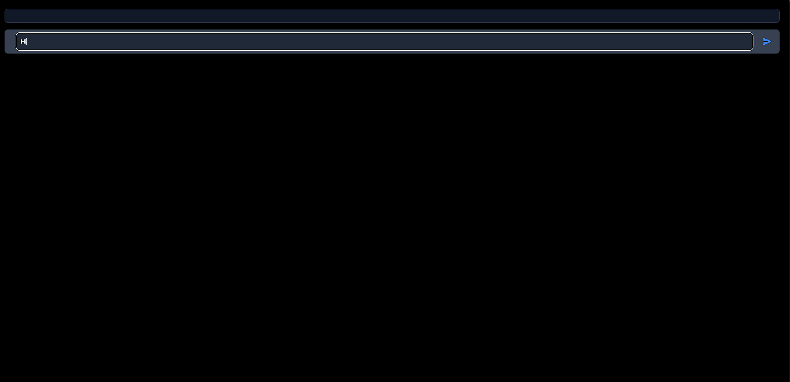

[](https://github.com/RianNegreiros/DotNetChatBot/actions/workflows/docker-ci.yml)

# Table of Contents
1. [Introduction](#chat-bot-application)
2. [Getting Started](#getting-started)
    - [Prerequisites](#prerequisites)
    - [Installing](#installing)
    - [Running with Docker Compose](#running-with-docker-compose)
3. [Usage](#usage)
4. [Extensions](#extensions)
5. [Rate Limiting](#rate-limiting)
6. [Built With](#built-with)
7. [Contact](#contact)
8. [License](#license)

# Chat Bot Application

This is a full stack application built with ASP.NET Core 8 and Next.js with TypeScript and TailwindCSS. The application is a chat bot powered by PaLM 2.



# Article Reference

This application is part of the blog post titled "[Creating a Chatbot with ASP.NET Core, Next.js and PaLM API](https://riannegreiros.dev/post/creating-a-chatbot-with-asp-net-core-next-js-and-palm-api)". Feel free to read the article for a more detailed explanation of the application.

## Getting Started

These instructions will get you a copy of the project up and running on your local machine for development and testing purposes.

### Prerequisites

- [.NET 8.0 SDK](https://dotnet.microsoft.com/en-us/download/dotnet/8.0)
- [Node.js](https://nodejs.org/en/blog/release/v20.11.0)

### Installing

1. Clone the repository
```bash
 git clone https://github.com/RianNegreiros/DotNetChatBot.git
```

2. Setup the server configuration
```bash
 cd src/API
 cp appsettings.json.example appsettings.json
```

Then set the `LANGUAGE_MODEL:API_KEY` with your PaLM API key or get one [here](https://ai.google.dev/gemini-api/docs/api-key)

3. Setup the client configuration
```bash
 cd src/client
 cp .env.example .env
```

4. Restore the .NET packages and run the ASP.NET API
```bash
 dotnet restore
 dotnet run --project src/API
```

5. Navigate to the client directory, install the dependencies and run the client
```bash
 cd src/client
 npm install
 npm run dev
```

### Running with Docker Compose

If you have Docker Compose installed, you can use it to run the application:

1. Setup the server configuration
```bash
 cd src/API
 cp appsettings.json.example appsettings.json
```

Then set the `LANGUAGE_MODEL:API_KEY` with your PaLM API key or get one [here](https://ai.google.dev/gemini-api/docs/api-key)

2. Setup the client configuration
```bash
 cd src/client
 cp .env.example .env
```

3. Run the Docker compose
```bash
docker compose up --build
```

The application should now be running at `http://localhost:3000`.

## Usage

### API

  The API has the following endpoints:

  - `/prompt/{text}`: This endpoint generates a language model response from the PaLM API. The `{text}` parameter is the text to be processed by the language model. The endpoint returns a JSON response with the generated message.

  - `/health`: This endpoint checks the health of the application and its connection to the Google API.

  The API also includes Swagger UI for testing and documenting the API endpoints. You can access it at `/swagger`.

  #### Extensions

  The project includes the following extensions:

  - `AddSwaggerExtension`: This extension adds Swagger/OpenAPI support to the project.

  - `AddCorsExtension`: This extension adds CORS policy to the project. By default, it allows POST requests from `http://localhost:3000`.

  - `AddHealthChecksExtension`: This extension adds health checks to the project. It includes a custom health check for the Google API.

  - `AddServicesExtension`: This extension adds an HTTP client to the project.

  #### Rate Limiting

  The project uses rate limiting to limit the number of requests from a single IP address. The limit is set to 10 requests per 10 seconds. If the limit is exceeded, the API will return a 429 Too Many Requests status code.

  ### Client

  The client has a chat interface where you can interact with the chat bot. The chat interface is rendered by the `Chat` component. The `Chat` component uses the `useChat` hook to manage the state of the chat.

  The `useChat` hook uses the `axios` library to send POST requests to the chat bot API. The responses from the API are stored in the `messages` state variable. The `messages` state variable is also stored in the session storage to persist the chat history across page reloads.

  The `Chat` component also uses the `Loading` component to display a loading animation while waiting for the response from the API, and the `DangerError` component to display any error messages.

## Built With
  - [ASP.NET Core 8](https://learn.microsoft.com/en-us/dotnet/core/whats-new/dotnet-8?source=recommendations)
  - [PaLM API](https://developers.googleblog.com/2023/03/announcing-palm-api-and-makersuite.html)
  - [Next.js](https://nextjs.org/docs)
  - [TypeScript](https://www.typescriptlang.org/)
  - [TailwindCSS](https://tailwindcss.com)
  - [axios](https://axios-http.com/)
  - [React Markdown](https://github.com/remarkjs/react-markdown)

## Contact

Website: [riannegreiros.dev](https://riannegreiros.dev)

## License

This project is licensed under the MIT License - see the [LICENSE](LICENSE) file for details
